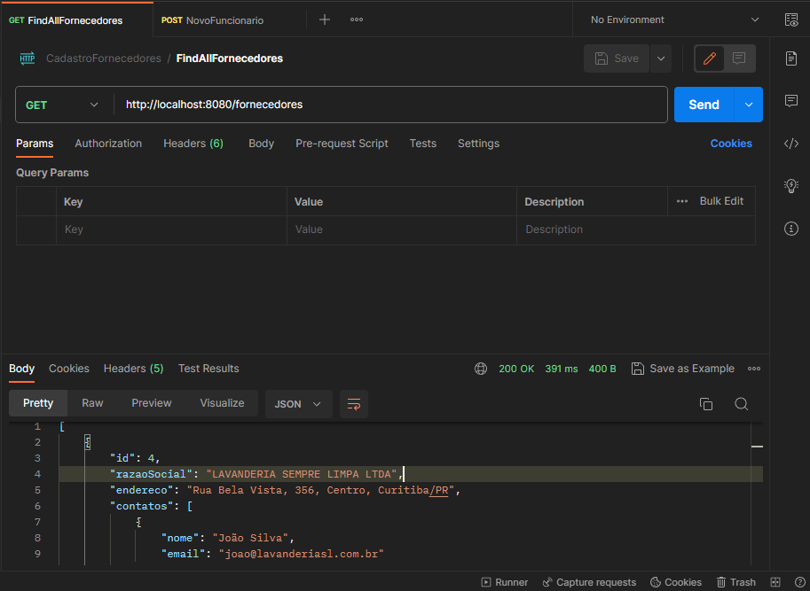

<h1 align="center">
  Cadastro de Fornecedores
</h1>

<p align="center">
 
 
</p>

Esta foi uma API desenvolvida para cadastro de fornecedores, ela foi criado utilizando Spring Boot e Postgresql como banco de dados. 
Para o Fornecedor se cadastrar, ele deve passar: Razão Social, Endereço, e obrigatoriamente UM ou mais Contatos, com os contatos sendo: Nome e Email.


## Tecnologias
 
- [Spring Boot](https://spring.io/projects/spring-boot)
- [Postgresql](https://www.postgresql.org/docs/)
- [Spring Data JPA](https://docs.spring.io/spring-data/jpa/docs/current/reference/html/)

## Práticas adotadas

- SOLID
- API RESTFUL
- Uso de DTOs para a API
- Injeção de Dependências
- Mapeamento ORM

## Como Executar

### Localmente
- Clonar repositório git
- Construir o projeto:
```
./mvnw clean package
```
- Executar:
```
java -jar place-service/target/place-service-0.0.1-SNAPSHOT.jar
```

A API poderá ser acessada em [localhost:8080](http://localhost:8080).

## API Endpoints

Para fazer as requisições HTTP abaixo, foi utilizada a ferramenta [Postman](https://www.postman.com/api-documentation-tool/):


- POST /fornecedores
<h4>Caso o usuario tente fazer cadastro de um fornecedor sem passar pelo menos UM contato, terá um Bad Request e retornara a mensagem "O fornecedor deve ter pelo menos 1(UM) contato"</h4>

```
http://localhost:8080/fornecedores

HTTP/1.1 400 BAD REQUEST
Content-Length: 129
Content-Type: application/json

body: 
  {
    "razaoSocial" : "LAVANDERIA SEMPRE LIMPA LTDA",
    "endereco" : "Rua Bela Vista, 356, Centro, Curitiba/PR",
    "contato" : [{}]
}

<h4>Quando o usuário solicita ver todos os fornecedores cadastros, ele retorna dessa forma:</h4>

```
- GET http://localhost:8080/games
```
http :8080/games
HTTP/1.1 200 OK
Content-Length: 129
Content-Type: application/json

 {
        "id": 4,
        "razaoSocial": "LAVANDERIA SEMPRE LIMPA LTDA",
        "endereco": "Rua Bela Vista, 356, Centro, Curitiba/PR",
        "contatos": [
            {
                "nome": "João Silva",
                "email": "joao@lavanderiasl.com.br"
            },
            {
                "nome": "Ana Moraes",
                "email": "ana@lavanderiasl.com.br"
            }
        ]
    }
```

- GET /games/{id}
```
http :8080/games/10
HTTP/1.1 200 OK
Content-Length: 129
Content-Type: application/json

{
    "id": 10,
    "title": "Cuphead",
    "year": 2017,
    "genre": "Platform",
    "platforms": "XBox, Playstation, PC",
    "score": 4.6,
    "imgUrl": "https://raw.githubusercontent.com/devsuperior/java-spring-dslist/main/resources/9.png",
    "shortDescription": "Lorem ipsum dolor sit amet consectetur adipisicing elit. Odit esse officiis corrupti unde repellat non quibusdam! Id nihil itaque ipsum!",
    "longDescription": "Lorem ipsum dolor sit amet consectetur adipisicing elit. Delectus dolorum illum placeat eligendi, quis maiores veniam. Incidunt dolorum, nisi deleniti dicta odit voluptatem nam provident temporibus reprehenderit blanditiis consectetur tenetur. Dignissimos blanditiis quod corporis iste, aliquid perspiciatis architecto quasi tempore ipsam voluptates ea ad distinctio, sapiente qui, amet quidem culpa."
}

```

- PUT http://localhost:8080/games/10
```
http PUT : http://localhost:8080/games/10
HTTP/1.1 200 OK
Content-Length: 142
Content-Type: application/json
Body: 

{
    "score": 4.1
}

```